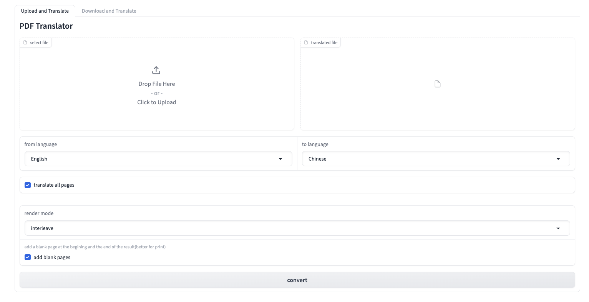
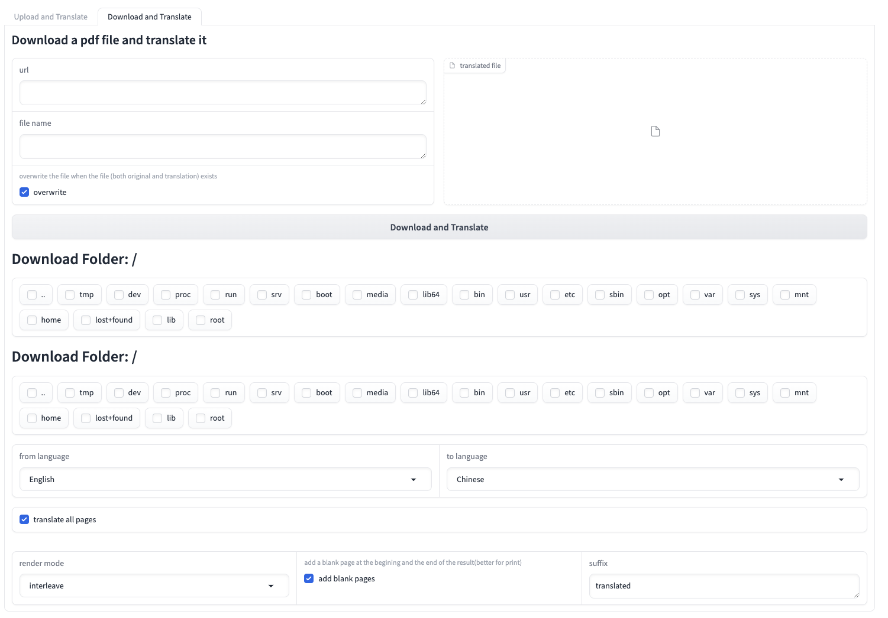

# LLM PDF Translator

## New Feature Introduction
This repository is inspired by [ppisljar/pdf-translator](https://github.com/ppisljar/pdf_translator/tree/main) and adds the following features:
- [GUI] Add support for download-save-translation process on the server (better for mobile devices)
- Support of Ollama and QWEN for translation (by api)
- Support multi threading for translation
- Make a better support of inplace translation of different languages (e.g. support Chinese translation)
- Support batch translation of PDF files without api calls (provides an example later)
- Use single process for ocr / layout model to **save vram**
- Use LLM for reference checking (fix the bug of supplemental translation)

## 1.Introduction
### 1.1 About the GUI
<h5 align="center">
  This repository offers an WebUI and API endpoint that translates PDF files using openai GPT, preserving the original layout.
</h5>

<h5 align="center">
   Option 1: Upload PDF file and download translated PDF file
</h5>
<p align="center">
  
</p>

<h5 align="center">
   Option 2: Download the PDF file by URL and save/download translated PDF file
</h5>

<p align="center">
  
</p>

## Features

- translate PDF files while preserving layout

- translation engines:
   - ollama (just added, works fine for translation)
   - openAI (best)
   - QWEN
   - google translate

- layout recognition engines:
   - UniLM DiT

- OCR engines:
   - PaddleOCR

- Render engine:
   - ReportLab

<!-- - Font recognition engines:
   - / -->


## 2.Installation 
### 2.0 Prerequisites
1. **Clone this repository**

```bash
   git clone https://github.com/poppanda/LLM_PDF_Translator.git
   cd LLM_PDF_Translator
```

### 2.1 Local installation
1. **prerequesites:**
- Basically ffmpeg and the font you want to use
- Check if you wants to use `uv` or `venv` for individual installation

2. **Install the dependencies**
- (Recommand)If you are using `uv`, run the following command
```shell
uv sync
uv pip install git+https://github.com/facebookresearch/detectron2.git
```
- Otherwise, run the following command
```shell
pip install -r requirements.txt
pip install git+https://github.com/facebookresearch/detectron2.git
```

### 2.2 docker installation

1. **Build the docker image via Makefile**

```bash
make docker-build
```

## 3. Run the server
### 3.1 Download the model

```bash
make get_models
```
### 3.2 Check the config.yaml and the fonts

1. **Edit config.yaml**
- The `type` could be `ollama`, `openai`, `qwen`, or `google`.
- The `api_key` is the corresponding API key.
- The `model` is the specific model name you want to use.

2. **Check the font you want to use in the 'render' part of config.yaml**
For a basic demo, you can download the font by:
```bash
make install-cn-font
```

### 3.3 Local run
If you are using `uv`:
```bash
uv run server.py
```
Otherwise
```bash
python3 server.py
```

### 3.4 Docker run
1. **Run the docker container via Makefile**

```bash
make docker-run
```

## GUI Usage

Access to GUI via browser.

```bash
http://localhost:8765
```

## Requirements

- NVIDIA GPU **(currently only support NVIDIA GPU)**
- Docker

## License

**This repository does not allow commercial use.**

This repository is licensed under CC BY-NC 4.0. See [LICENSE](./LICENSE.md) for more information.

## Some details of the new feature

### Feature 1: Use single process for ocr / layout model to **save vram**
- The scene is that if you run a LLM model locally (e.g. ollama), the ocr/layout model will be loaded for nothing while translation, which is a waste of vram (for about 5GB).
- This problem is fixed by
   - Seperate the ocr / layout process from the translation process.
   - Use a single process for ocr/layout model.
   - Kill the process before translation.

### Feature 2: Use LLM for reference checking
- The original code checks the reference by recognizing the 'reference' keyword in the title.
- The problem is that:
   - There may be some supplemental material after the reference, and by the original code, the supplemental material will be translated as well.
   - The 'reference' keyword may not be recognized in some cases.
- The problem is fixed by:
   - Use LLM to check the reference and skip the translation.

## TODOs

- [ ] Support M1 Mac or CPU
- [ ] switch to VGT for layout detection
- [ ] add font detection (family/style/color/size/alignment)
- [ ] add support for translating lists
- [ ] add support for translating tables
- [ ] add support for translating text within images

## Batch Translation Example

```python
# batch.py
import warnings
warnings.filterwarnings("ignore")
import server
import os
from pathlib import Path
import tempfile
from loguru import logger

pdf_dir = "" # path to the directory with pdf files

if __name__ == "__main__":
    translator = server.TranslateApi()
    files = list(os.scandir(pdf_dir))
    for file in files:
        if file.is_dir():
            files.extend(list(os.scandir(file.path)))
        elif file.is_file() and file.name.endswith(".pdf"):
            if file.name.endswith("_translated.pdf") or os.path.exists(file.path.replace(".pdf", "_translated.pdf")):
                logger.info(f"Skip {file.path}")
                continue
            logger.info(f"Translating {file.path}")
            response = translator._translate_pdf(
               file.path, 
               translator.temp_dir_name, 
               "English", 
               "Chinese", 
               translate_all=True, 
               p_from=0, 
               p_to=0, 
               side_by_side=True, 
               output_file_path=file.path.replace(".pdf", "_translated.pdf"))
```
      
## References
- For PDF layout analysis, using [DiT](https://github.com/microsoft/unilm).

- For PDF to text conversion, using [PaddlePaddle](https://github.com/PaddlePaddle/PaddleOCR) model.

